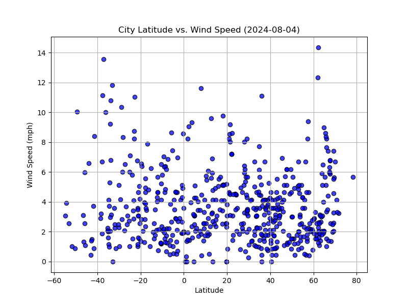
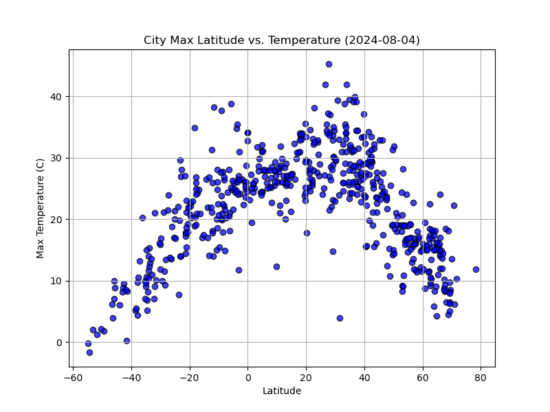
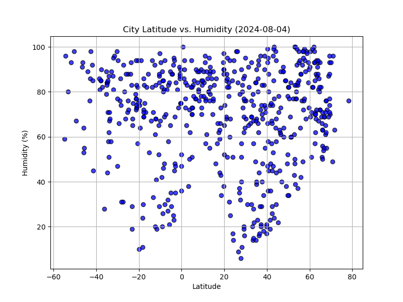
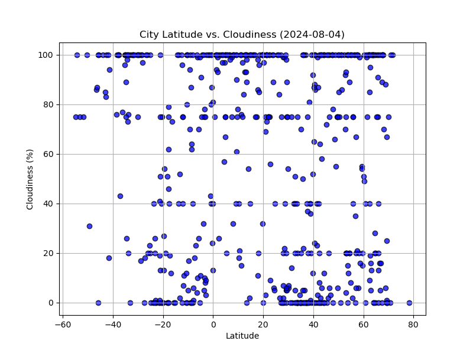

## Overview of the Jupyter Notebook PYTHON-API-CHALLENGE-FINAL 

The Jupyter notebooks, `WeatherPy.ipynb` and `VacationPy.ipynb`, are designed to analyze weather data across cities worldwide and identify vacation spots based on user-defined weather preferences.

## Dependencies

- **Python:** The primary programming language used for both notebooks.
- **Pandas:** A powerful data manipulation library in Python, used for organizing and handling the data efficiently.
- **Matplotlib:** A plotting library for creating static, interactive, and animated visualizations in Python.
- **NumPy:** Essential for large array and matrix processing, and provides mathematical functions to operate on these arrays.
- **Requests:** Used to handle HTTP requests to external APIs, such as the weather API and Google Maps API.
- **Jupyter Notebook:** An open-source web application that allows you to create and share documents that contain live code, equations, visualizations, and narrative text.
- **SciPy:** Used for scientific and technical computing.

### API Keys

- **Weather API Key:** Needed to fetch weather data.
- **Google Maps API Key:** Used for mapping functionalities in `VacationPy`.

### WeatherPy Notebook:

**Purpose:**
- This notebook aims to analyze how weather changes as you get closer to the equator. It utilizes a weather dataset that records various weather metrics such as temperature, humidity, cloudiness, and wind speed across different cities globally.

**Data Retrieval:**
- It fetches data from a weather API for a list of cities.

**Analysis:**
- The notebook conducts a comprehensive statistical analysis to observe relationships between latitude and different weather parameters. The results are visualized using scatter plots.

**Visualizations Include:**
- Temperature (Celsius) vs. Latitude
- Humidity (%) vs. Latitude
- Cloudiness (%) vs. Latitude
- Wind Speed (mph) vs. Latitude

### VacationPy Notebook:

**Purpose:**
- To help users find potential vacation destinations based on their weather preferences.

**Data Integration:**
- It leverages the Google Maps API to overlay weather data on a map, allowing users to identify ideal vacation spots.

**Functionality:**
- Users can specify their preferred temperature range, and the notebook will highlight cities that fall within those parameters on a map.

**Output:**
- Generates maps that show hotels in user-specified weather conditions, helping in planning vacations based on weather preferences.

## Conclusions from the Analysis

1. **City Latitude vs. Temperature:**
   - The temperature tends to increase as we approach the equator (0° Latitude), demonstrating a clear relationship between latitude and temperature. The highest temperatures are seen in cities close to the equator, while cities far from the equator, especially those closer to the poles, experience lower temperatures.

2. **City Latitude vs. Humidity:**
   - There is no strong relationship between latitude and humidity. Cities near the equator show varied humidity levels, suggesting other geographical or meteorological factors affect humidity more than just latitude.

3. **City Latitude vs. Cloudiness:**
   - Cloudiness shows no clear pattern with respect to latitude. Cities across different latitudes exhibit a wide range of cloudiness percentages, indicating that latitude alone does not determine cloud cover.

4. **City Latitude vs. Wind Speed:**
   - Wind speed data across cities suggest that extreme latitudes might experience slightly higher wind speeds, but overall, wind speed does not show a consistent trend with latitude.

## Summary

The `WeatherPy` notebook provides valuable insights into how weather parameters vary with latitude, which is useful for understanding global weather patterns. The `VacationPy` notebook builds on this analysis to offer a practical application by identifying potential vacation spots based on desired weather conditions. This combination of data-driven analysis and application provides users with both informative insights and practical tools for travel planning.

## Conclusions drawn from the Visualizations

1. City Latitude vs. Wind Speed
Observation: The scatter plot displays a relatively uniform distribution of wind speeds across various latitudes, with most data points clustering between 0 to 10 mph. There are sporadic occurrences of higher wind speeds, but these do not show a clear pattern or concentration at any specific latitude.
Conclusion: There appears to be no significant correlation between latitude and wind speed, as high and low wind speeds can occur at any latitude. This suggests that other factors, such as geographical features and local weather patterns, likely play a more crucial role in determining wind speed rather than just latitude.

2. City Latitude vs. Temperature
Observation: The temperature shows a clear trend of increasing as the latitude approaches the equator (0° Latitude), with temperatures peaking at tropical latitudes and dropping significantly as the latitude moves towards the poles.
Conclusion: There is a strong positive correlation between proximity to the equator and higher temperatures, which supports the understanding that tropical regions tend to be warmer. This visual effectively illustrates the typical temperature gradient from the equator towards the poles, known in climatology.

3. City Latitude vs. Humidity
Observation: Humidity levels are spread widely across latitudes, with a significant number of cities showing high humidity levels (60% and above). There is no discernible pattern linking latitude to specific humidity ranges.
Conclusion: Latitude alone is not a predictor of humidity. High humidity can be found across a broad range of latitudes, indicating that local environmental factors such as proximity to bodies of water and regional climate types have a more direct impact on humidity levels.

4. City Latitude vs. Cloudiness
Observation: Cloudiness percentages vary widely across all latitudes, with complete cloud cover (100%) and clear skies (0%) occurring throughout the range. There is no apparent trend or concentration of cloudiness at any particular latitude.
Conclusion: Similar to humidity, cloudiness does not show a correlation with latitude. The scatter plot demonstrates that cloud cover is influenced by factors other than latitude, possibly including local atmospheric conditions and weather systems, rather than a straightforward relationship with geographical location.

## FINAL Summary
These visuals provide a comprehensive look at how certain weather parameters change with latitude but also highlight that latitude is not always the determining factor for weather conditions such as humidity and cloudiness. The strong correlation between latitude and temperature is the most consistent finding, aligning well with established scientific understanding. These insights can be particularly useful for educational purposes, illustrating basic meteorological principles, and for practical applications in climate studies and related fields.

